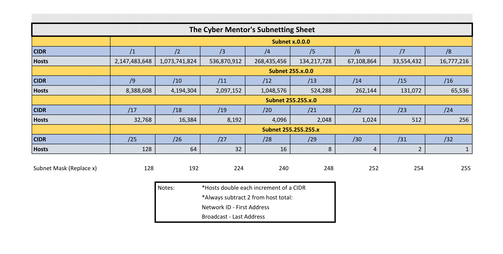

# Cheatsheet/Notes

## Subnet guide



## Common Ports

<table>
  <thead>
    <tr>
      <th style="text-align:left"><b>Protocol</b>
      </th>
      <th style="text-align:left">Port</th>
      <th style="text-align:left">Service</th>
    </tr>
  </thead>
  <tbody>
    <tr>
      <td style="text-align:left">TCP</td>
      <td style="text-align:left">21</td>
      <td style="text-align:left">FTP</td>
    </tr>
    <tr>
      <td style="text-align:left">TCP</td>
      <td style="text-align:left">22</td>
      <td style="text-align:left">SSH</td>
    </tr>
    <tr>
      <td style="text-align:left">TCP</td>
      <td style="text-align:left">25</td>
      <td style="text-align:left">SMTP</td>
    </tr>
    <tr>
      <td style="text-align:left">TCP</td>
      <td style="text-align:left">53</td>
      <td style="text-align:left">DNS</td>
    </tr>
    <tr>
      <td style="text-align:left">TCP</td>
      <td style="text-align:left">80, 443</td>
      <td style="text-align:left">HTTP/HTTPS webserver</td>
    </tr>
    <tr>
      <td style="text-align:left">TCP</td>
      <td style="text-align:left">137-139</td>
      <td style="text-align:left">Windows NetBIOS</td>
    </tr>
    <tr>
      <td style="text-align:left">TCP</td>
      <td style="text-align:left">445</td>
      <td style="text-align:left">
        <p>Windows - SMB</p>
        <p>Linux - Samba service</p>
      </td>
    </tr>
    <tr>
      <td style="text-align:left">TCP</td>
      <td style="text-align:left">1433-1434</td>
      <td style="text-align:left">MSSQL Database</td>
    </tr>
    <tr>
      <td style="text-align:left">TCP</td>
      <td style="text-align:left">3306</td>
      <td style="text-align:left">MySQL Database</td>
    </tr>
    <tr>
      <td style="text-align:left">TCP</td>
      <td style="text-align:left">8080, 8443</td>
      <td style="text-align:left">HTTP(s) web server, HTTP proxy</td>
    </tr>
  </tbody>
</table>

## Routing


This part is pretty important 😉 


### IP

```bash
ip route add 192.168.72.23 via 10.10.10.10(VPN Gateway)
```

### Network

```bash
ip route add 192.168.72.0/24 via 10.10.10.10(VPN Gateway)
```

## Interactive shells

```bash
bash -i
python -c 'import pty; pty.spawn("/bin/sh")'
echo os.system('/bin/bash')
/bin/sh -i
perl -e 'exec "/bin/sh";'
perl: exec "/bin/sh";
ruby: exec "/bin/sh"
lua: os.execute('/bin/sh')
```

## Recommended Shells

| Server | Web Shell |
| :--- | :--- |
| Windows | ASP  |
| Apache TomCat | JSP |
| Apache | PHP |

### Reverse Shells

[Pentest Monkey Cheatsheet](https://pentestmonkey.net/cheat-sheet/shells/reverse-shell-cheat-sheet)

